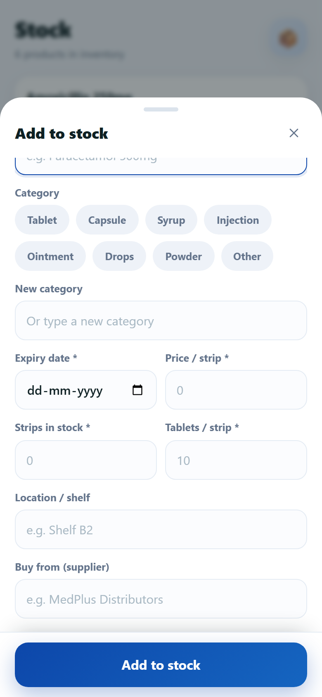

<p align="center">
  
</p>

<h1 align="center">DataPharm</h1>

<p align="center">
  <b>Medicine inventory & billing for small pharmacies — 100% offline, runs on your Android phone.</b>
</p>

<p align="center">
  <a href="https://react.dev"></a>
  <a href="https://capacitorjs.com"></a>
  <a href="https://vitejs.dev"></a>
  
  
</p>

<p align="center">
  
</p>

DataPharm is a fast, phone-first stock manager and billing app built for medicine shops. Track every strip and loose tablet, sell with discounts in seconds, scan your own payment QR, and export clean PDF / Word / CSV reports — all without any internet connection or account.

## ✨ Features

### 📦 Inventory
- Add, edit & delete products — name, price, tablets per strip, expiry, shelf location, supplier and category
- **Restock** with a stepper and a fresh batch expiry date (required again after a product runs out)
- Stock is tracked as **strips + loose tablets**, and partial-strip sales are handled automatically
- 8 default categories (Tablet, Capsule, Syrup, Injection, Ointment, Drops, Powder, Other) plus your own custom ones
- Instant search, category filter rail and alphabetical sorting

### 🏠 Dashboard
- One-tap stats: total products · expiring soon · low stock, each drilling into its own list
- Expiry awareness on every row: `92d left`, `Expired 3d ago`, `Expires today`
- **Low-stock (< 2 strips)** and **out-of-stock** badges with clear “not available for sale” states

### 💸 Selling
- Tap products to build a cart, sell **by strip or by tablet**, adjust quantity with a stepper
- Percentage discounts with live totals (`5 × ₹5 − 10% = ₹22.50`)
- Optional buyer details (name / phone / address) recorded with the sale
- **Payment QR popup** — upload your own UPI/QR image in Settings; it appears when you tap *Sell*
- Expired products require an explicit confirmation before they can be sold
- Stock is deducted automatically; low-stock alerts fire right after the sale

### 🕒 History & Reports
- Sales **and** stock-in entries grouped by day (Today / Yesterday / date), with filters
- One-tap export to **PDF, Word (DOCX), CSV or JSON** — then *Save to…* anywhere or *Share* via WhatsApp, email, Drive…

### 🔔 Notifications (Android)
- Local alerts for low stock, expiring-soon, sale success, sale cancelled and QR set — each individually toggleable
- Once-per-day launch reminders for products that need attention
- Friendly permission flow with a *Open Settings* fallback when notifications are blocked

### 🔒 Privacy-first
- **100% offline** — every byte of data lives in your phone's local storage, never on a server
- No account, no internet permission, no analytics, no tracking

## 📱 Screens

| Selling dock | Scan-to-pay QR | Add product |
|:---:|:---:|:---:|
|  |  |  |

| Stock | History | Settings |
|:---:|:---:|:---:|
|  |  |  |

## 🛠 Tech Stack

| Layer | Choice |
| --- | --- |
| UI | React 19 + Vite 6 |
| Native shell | Capacitor 8 (Android) |
| Styling | Hand-written CSS (Manrope font, dark-blue medical theme) |
| Reports | jsPDF + jspdf-autotable · docx · CSV · JSON |
| Native plugins | FileSaver (system “Save to…” picker) · Local Notifications · Share · Filesystem |

A ready-to-install build is included in the repo root: **`DataPharm.apk`**.

## 🚀 Getting Started

### Prerequisites
- **Node.js 18+** and npm (for the web app)
- **Android Studio** (or just a JDK 17 + Android SDK) and a phone with *Install from unknown sources* enabled — only if you want to build the APK yourself

### Run on the web
```bash
npm install
npm run dev        # opens http://localhost:5173
```
> 💡 Append **`?demo=1`** to the URL to load the app with sample products and sales so you can try selling immediately.

### Build the Android app
```bash
npm run build               # builds the web bundle into dist/
npx cap sync android        # copies it into the native project
cd android
gradlew.bat assembleDebug   # (Linux/macOS: ./gradlew assembleDebug)
```
Your APK will be at `android/app/build/outputs/apk/debug/app-debug.apk` — transfer it to your phone and install.

### Scripts
| Command | What it does |
| --- | --- |
| `npm run dev` | Start the Vite dev server |
| `npm run build` | Production build into `dist/` |
| `npm run preview` | Serve the production build locally |
| `node scripts/preview.mjs` | Headless UI verification + screenshot capture (needs the dev server running) |
| `node scripts/verify-ui.mjs` · `verify-new.mjs` · `verify-icons.mjs` | Extra automated UI checks |

## 📁 Project Structure

```
├── android/                 # Capacitor Android project (incl. custom plugins)
├── public/  logo/  screenshots/
├── scripts/                 # Preview & verification scripts
├── src/
│   ├── components/          # Sheet, SellingPanel, ProductForm, Confirm, Icons…
│   ├── lib/                 # store (localStorage DB), pricing, export, notifications, permissions, back
│   ├── screens/             # Dashboard, Stock, History, Settings
│   ├── App.jsx              # Navigation, selling flow, back gestures, notifications
│   └── styles.css
├── capacitor.config.json
├── index.html
├── package.json
└── vite.config.js
```

## 📄 Data & Privacy

All data (products, sales, stock-in records, settings, payment QR) is stored locally in the browser/device via `localStorage` under `datapharm:v1`. Clearing the app data or tapping **Settings → Clear all data** erases everything. No data ever leaves the device.

---

Built with ❤️ for neighbourhood pharmacies.
