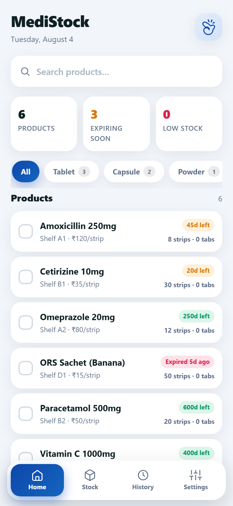
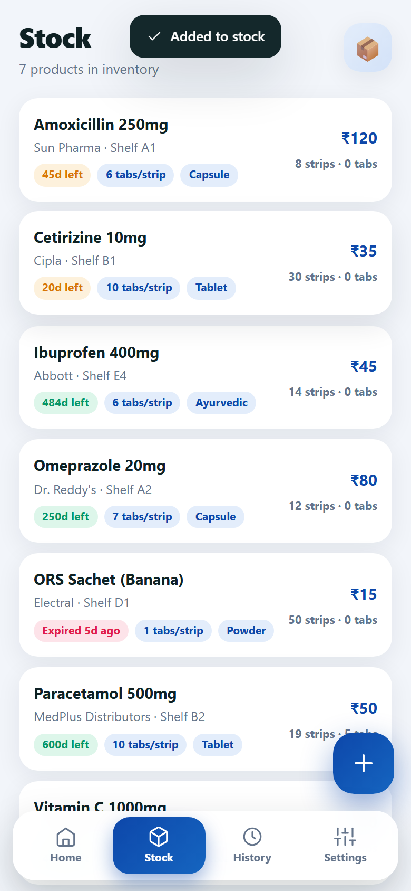
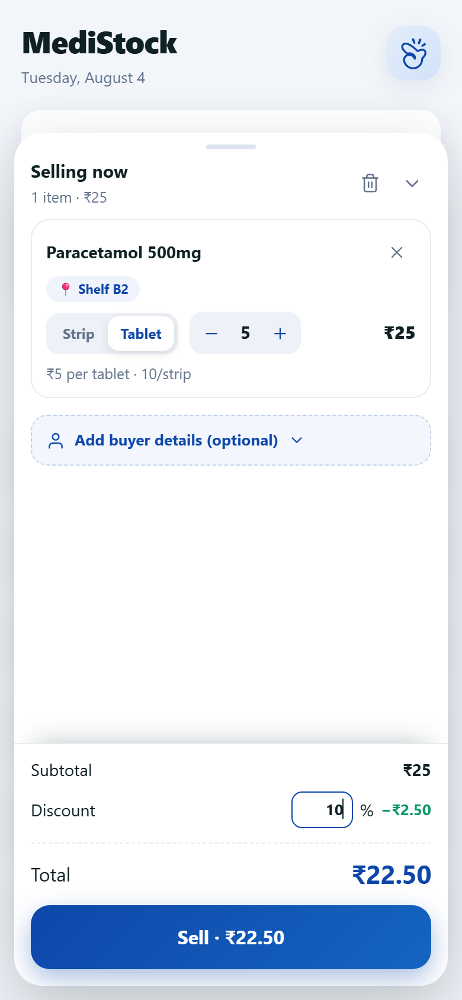
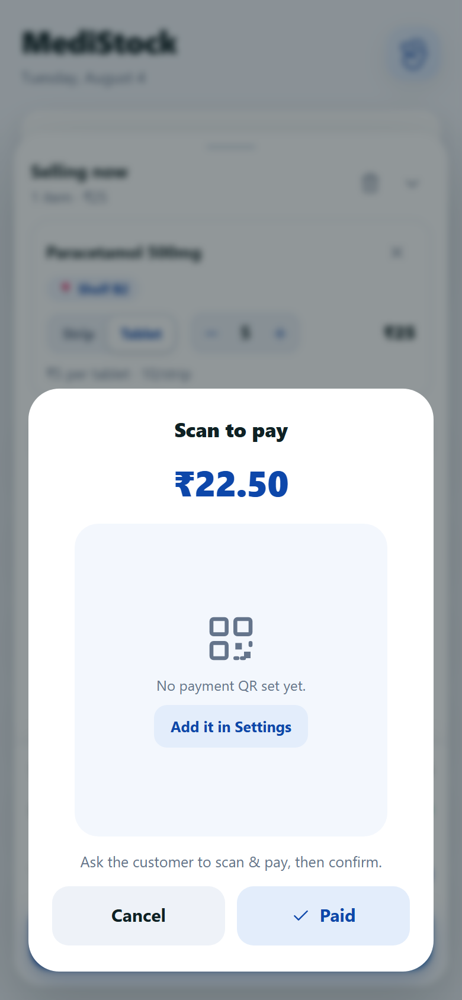
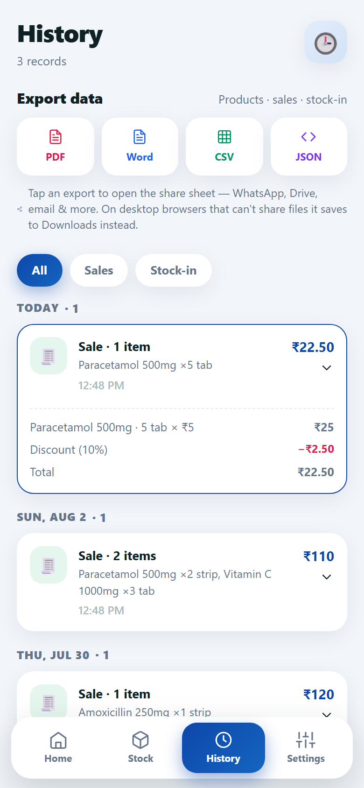
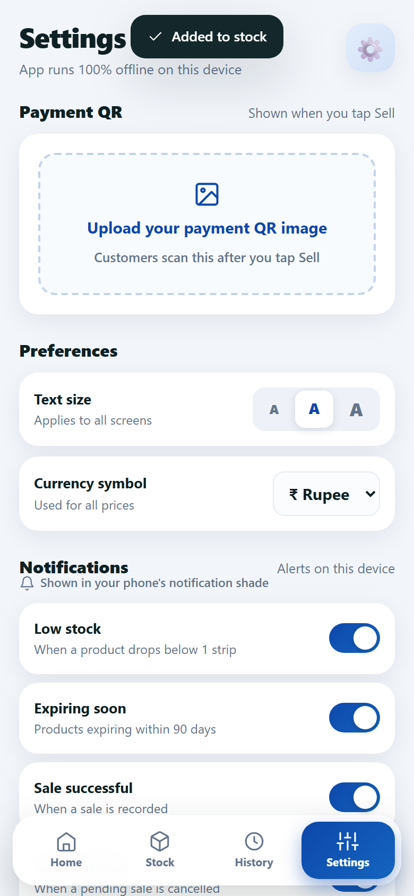

<p align="center">
  
</p>

<h1 align="center">DataPharm</h1>

<p align="center">
  <b>Pharmacy POS & inventory management for small independent medical stores — offline-first, built for India.</b>
</p>

<p align="center">
  <a href="https://react.dev"></a>
  <a href="https://capacitorjs.com"></a>
  <a href="https://vitejs.dev"></a>
  
  
  
</p>

<p align="center">
  
</p>

---

DataPharm is a fast, phone-first Point of Sale and stock management app built specifically for small independent pharmacies and medical stores in India. It is designed to replace the traditional method of remembering stock by memory or shelf labels — giving every salesman a powerful tool that fits in their pocket.

Track every strip and loose tablet, manage expiry dates, serve multiple customers simultaneously, scan medicine barcodes, accept UPI payments, and export clean reports — all without requiring an internet connection, a server, or an account.

The name is a deliberate double meaning: **Data** (as in database / datafarm) + **Pharm** (pharmacy). The logo is a red pill (medicine) crossed with a forward slash (code/data), together forming a medical cross — medicine meets technology.

---

## ✨ Features

### 📦 Inventory Management
- Add, edit and delete medicines with full details — name, category, shelf location, supplier, price, expiry date, tablets per strip, and barcode
- **Smart unit system** — stock fields adapt to the selected category:
  - Tablet / Capsule → strips + tablets per strip
  - Syrup / Drops → bottles + ML per bottle
  - Injection → vials + ML per vial
  - Ointment → tubes + grams per tube
  - Powder → packs + grams per pack
- **Restock flow** — dedicated restock sheet with expiry date required for every new batch; partial strips are tracked separately from whole strips
- 8 built-in categories (Tablet, Capsule, Syrup, Injection, Ointment, Drops, Powder, Other) plus unlimited custom categories
- Instant search with category filter rail and alphabetical sorting
- Shelf location badge on every product card for fast physical retrieval

### 🏠 Dashboard
- At-a-glance stats: total products · expiring soon · low stock, each tappable to drill into the filtered list
- Expiry countdown on every row — `92d left`, `Expires today`, `Expired 3d ago` — colour coded amber and red
- Low stock (below 2 strips) and out-of-stock badges with clear visual states
- **Online / Offline mode toggle** — pill-switch in the top bar; offline mode uses only local database, online mode enables barcode camera scanning and market price comparison

### 🛒 Multi-Customer Session System
- Serve up to **10 customers simultaneously** without losing any cart data
- Tap the DataPharm logo (top right) to open the customer session panel — slides in from the right
- Each customer has their own isolated cart, search query, discount, and buyer details
- Sessions display the customer's name (if entered during checkout), item count, and time of creation
- A badge count on the logo icon shows how many active sessions are open
- Completing a payment automatically closes that customer's session and switches back to the next one
- Sessions are held in memory — the app never mixes one customer's medicines with another's

### 💸 Selling & Checkout
- Tap any product to add to the current customer's cart — sell by strip or by individual tablet/unit
- Quantity stepper with live price calculation
- Percentage discount field with real-time total update
- Optional buyer details — name, phone, address — recorded with every sale
- **UPI QR payment popup** — upload your shop's QR image once in Settings; it appears automatically when you tap Sell, with the total amount shown below it
- Expired medicines require explicit confirmation before they can be sold
- Stock deducted automatically on payment confirmation; low-stock notification fires immediately after

### 📷 Barcode Scanner (Online mode)
- Tap the camera icon in the search bar (visible in Online mode only) to open a live barcode scan
- Powered by **Google ML Kit** — fast, accurate, fully on-device, no internet required for scanning
- Supports EAN-13, EAN-8, QR Code, Code 128, Code 39, UPC-A, UPC-E, Data Matrix
- If barcode matches a product in the database → opens that product's detail sheet instantly
- If barcode is not found → offers to create a new product with the barcode pre-filled
- Barcode field also available in the Add Product form with an inline scan button for quick entry

### 🕒 History & Reports
- Complete log of all sales and stock-in entries grouped by day (Today / Yesterday / date)
- Filter by All / Sales / Stock-in
- One-tap export to **PDF, Word (DOCX), CSV or JSON**
- Exported files include product table, sales history, buyer details, and revenue summary
- Share directly via WhatsApp, email, Google Drive, or save locally

### 🔔 Notifications (Android)
- Local push alerts for: low stock, expiring soon, sale confirmed, sale cancelled, QR code set
- Each notification type individually toggleable in Settings
- Once-per-day launch reminders for products needing attention
- Friendly permission flow with "Open Settings" fallback if notifications are blocked

### 🌗 Appearance
- Dark theme by default — deep navy `#0D1117` background matching the app icon
- Light theme available in Settings → Appearance
- Inter font throughout for maximum readability at small sizes
- Three text size options (small / medium / large) in Settings

### 🔒 Privacy & Data
- **100% offline** — all data lives in the phone's local storage under `datapharm:v1`
- No account required, no internet permission needed for core features, no analytics, no tracking, no ads
- Data can be exported anytime or wiped via Settings → Clear all data

---

## 📱 Screenshots

| Dashboard | Stock | Selling |
|:---:|:---:|:---:|
|  |  |  |

| Payment QR | History | Settings |
|:---:|:---:|:---:|
|  |  |  |

---

## 🛠 Tech Stack

| Layer | Technology |
|---|---|
| UI framework | React 19 + Vite 6 |
| Native shell | Capacitor 7 (Android) |
| Styling | Hand-written CSS — Inter font, dark navy theme |
| Local database | localStorage (`datapharm:v1`) |
| Barcode scanning | `@capacitor-mlkit/barcode-scanning` (Google ML Kit, on-device) |
| PDF export | jsPDF + jspdf-autotable |
| Word export | docx |
| Native plugins | Capacitor Filesystem · Local Notifications · Share · custom FileSaver plugin |
| Build tools | Gradle 8 + Java 21 (Microsoft OpenJDK) |

---

## 🚀 Getting Started

### Prerequisites

- **Node.js 18+** and npm
- **Android Studio** with Android SDK (for building the APK)
- **Java 21** — install via `winget install Microsoft.OpenJDK.21` on Windows
- An Android phone with **Install from unknown sources** enabled (for sideloading the debug APK)

### Run in the browser (quickest)

```bash
npm install
npm run dev
# Opens at http://localhost:5173
```

> 💡 Append `?demo=1` to the URL to load sample products and sales so you can try the selling flow immediately without adding stock manually.

### Build the Android APK

```bash
# Step 1 — build the web bundle
npm run build

# Step 2 — copy into the Android project
npx cap sync android

# Step 3 — compile the APK (Windows)
cd android
$env:JAVA_HOME="C:\Program Files\Microsoft\jdk-21.0.12.8-hotspot"
.\gradlew.bat assembleDebug --no-daemon

# Step 4 — install on connected device or emulator
adb install -r app\build\outputs\apk\debug\app-debug.apk
```

The APK will be at:
```
android/app/build/outputs/apk/debug/app-debug.apk
```

Transfer to your phone via USB, WhatsApp, or Google Drive and install directly.

### Fix: SDK location not found

If the build fails with `SDK location not found`, create this file:

```
android/local.properties
```

With this content (adjust username if needed):
```
sdk.dir=C:/Users/YOUR_USERNAME/AppData/Local/Android/Sdk
```

---

## 📁 Project Structure

```
DataPharm/
├── android/                          # Capacitor Android project
│   └── app/src/main/
│       ├── AndroidManifest.xml       # Camera permission + ML Kit config
│       └── java/com/datapharm/app/   # Custom native plugins
│           ├── MainActivity.java
│           ├── FileSaverPlugin.java
│           ├── AppSettingsPlugin.java
│           └── MediaPermissionsPlugin.java
├── logo/                             # SVG logo files
├── public/                           # Static assets (favicon, splash)
├── screenshots/                      # App screenshots for README
├── scripts/                          # UI verification scripts
├── src/
│   ├── components/
│   │   ├── Confirm.jsx               # Reusable confirmation dialog
│   │   ├── Icons.jsx                 # All SVG icon components
│   │   ├── PermissionDialog.jsx      # Camera/notification permission UI
│   │   ├── ProductForm.jsx           # Add / edit product form
│   │   ├── SellingPanel.jsx          # Cart, discount, checkout, payment
│   │   ├── SessionPanel.jsx          # Multi-customer session manager
│   │   └── Sheet.jsx                 # Bottom sheet component
│   ├── lib/
│   │   ├── back.js                   # Android hardware back button handler
│   │   ├── export.js                 # PDF / DOCX / CSV / JSON export logic
│   │   ├── notifications.js          # Local notification scheduling
│   │   ├── permissions.js            # Camera and notification permission helpers
│   │   ├── pricing.js                # Unit price and line total calculations
│   │   └── store.js                  # localStorage DB — load, persist, clear, migrate
│   ├── screens/
│   │   ├── Dashboard.jsx             # Home screen — search, product list, session trigger
│   │   ├── History.jsx               # Sales + stock-in log, export buttons
│   │   ├── Settings.jsx              # QR upload, preferences, notifications, theme, clear data
│   │   └── Stock.jsx                 # Inventory list, product detail sheet, restock flow
│   ├── App.jsx                       # Root — navigation, session state, sell action, notifications
│   ├── main.jsx                      # React entry point
│   └── styles.css                    # All styles — tokens, components, dark/light themes
├── capacitor.config.json
├── index.html
├── package.json
└── vite.config.js
```

---

## 🗄 Data Model

All data is stored in a single localStorage key `datapharm:v1` as a JSON object:

```json
{
  "products": [
    {
      "id": "uuid",
      "name": "Paracetamol 500mg",
      "category": "Tablet",
      "location": "Shelf A",
      "barcode": "8901234567890",
      "supplier": "MedLine Pharma",
      "price": 18,
      "strips": 10,
      "tabletsPerStrip": 10,
      "expiry": "2026-08",
      "createdAt": 1722765432000
    }
  ],
  "sales": [
    {
      "id": "uuid",
      "ts": 1722765432000,
      "items": [{ "id": "uuid", "name": "Paracetamol 500mg", "qty": 2, "unit": "strip", "price": 18 }],
      "discountPct": 10,
      "total": 32.40,
      "buyer": { "name": "Dave Batista", "phone": "9999999999", "address": "" }
    }
  ],
  "stockIns": [
    {
      "id": "uuid",
      "ts": 1722765432000,
      "productId": "uuid",
      "name": "Paracetamol 500mg",
      "strips": 5
    }
  ],
  "categories": ["Tablet", "Capsule", "Syrup", "Injection", "Ointment", "Drops", "Powder", "Other"],
  "settings": {
    "currency": "₹",
    "qrImage": "",
    "fontSize": "md",
    "onlineMode": false,
    "themeMode": "dark",
    "notifications": {
      "lowStock": true,
      "expiringSoon": true,
      "saleSuccess": true,
      "saleCancelled": true,
      "qrSet": true
    }
  }
}
```

> A one-time migration automatically carries over data from the legacy `medistock:v1` key if found.

---

## 🗺 Roadmap

- [ ] WebRTC P2P sync between multiple devices in the same shop (no cloud required)
- [ ] Shop pairing via QR code for multi-device setup
- [ ] Green / yellow / red stock state system (soft reservations across devices)
- [ ] Owner / worker role access control with daily QR verification
- [ ] Market price comparison via online pharmacy APIs (online mode)
- [ ] Vendor ordering with delivery estimates (online mode)
- [ ] Play Store release (signed APK)

---

## 🤝 Contributing

This project is purpose-built for small Indian pharmacies. If you run or work at a medical store and have feature suggestions based on real workflow needs, open an issue — practical feedback from actual users is the most valuable contribution.

---

## 📄 Licence

MIT — use it, fork it, build on it.

---

<p align="center">Built for neighbourhood pharmacies across India 🇮🇳</p>
